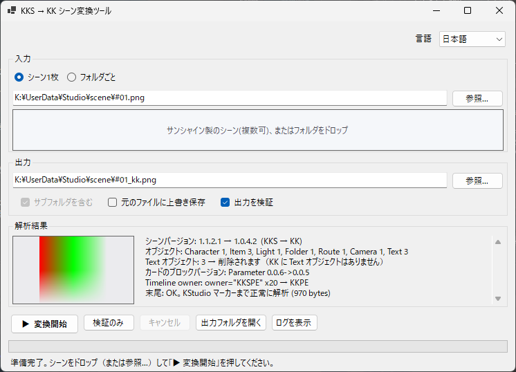
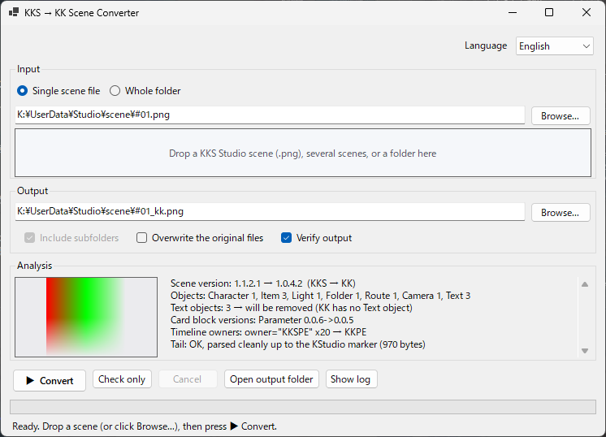

<div align="center">

  # KKS → KK Scene Converter

  **Down-convert Koikatsu Sunshine (KKS) Studio scenes so that Koikatsu (KK) CharaStudio can load them.**
  コイカツサンシャイン（KKS）の Studio シーンを、無印コイカツ（KK）の CharaStudio で読み込める形式に変換するツール。

  
  
  

  [日本語](#日本語) · [English](#english)
</div>

> [!CAUTION]
> **変換前にシーンを必ずバックアップしてください。** 変換後のシーンをサンシャインで読み込むと元のシーンデータから一部のデータが抜け落ちる場合があります。
>
> **Always back up your scenes before converting.** Loading a converted scene back into Koikatsu Sunshine may lose some of the data from the original scene.

---

## 日本語

### 概要

コイカツサンシャインのキャラスタジオで作成されたシーンデータを無印のキャラスタジオで読めるように変換します。
GUIアプリとして使えますが、CLI上で扱うこともできます。

### ダウンロード

[Releases](../../releases) から：

| | 説明 |
|---|---|
| `KksSceneConv.exe`（約 66 MB） | **推奨**。解凍してそのままご利用可能です。 |
| `KksSceneConv-lite.exe`（約 1 MB） | ご利用いただく場合、[.NET 8.0](https://dotnet.microsoft.com/download/dotnet/8.0) 以上が必要です。 |


### 使い方（GUI）



1. サンシャイン製のシーンデータ、またはフォルダをウィンドウにドロップ、または「参照」で選択。(exe のアイコンにドロップしても開けます)
2. 出力先を確認。参照または直接パスを入力することで出力先を変更できます。
3. **▶ 変換開始**を押すと変換されます。

「検証のみ」は変換せずに構造を解析し、変換可能な形式かを確認します。「出力を検証」をオンにしておくと、変換後に出力を自動で再解析します。

### 使い方（CLI）

```bat
KksSceneConv.exe convert in.png [out.png] [-v]     :: 変換（既定の出力名は in_kk.png）
KksSceneConv.exe check   scene.png                 :: 解析のみ（KK / KKS どちらも可）
KksSceneConv.exe batch   D:\scenes D:\out [-r]     :: フォルダ内の *.png を一括変換（-r: サブフォルダも。シーン以外の画像やカードはスキップ）
KksSceneConv.exe help
```

終了コード: 0 = 成功、1 = 失敗 / NG、2 = 引数エラー。

> GUI アプリとしてビルドされているため、実際の変換処理が終了する前に終了コードを返す場合があります。バッチファイルなどで終了コードを判定したい場合は`start /wait`や`Start-Process -Wait`で終了を待ってください。

### ビルド / 自己テスト

```powershell
pwsh -File tools/build.ps1                                 # dist\self-contained と dist\lite を生成
pwsh -File tools/selftest.ps1 -Scene "KKS のシーン.png"   # 変換 → 出力を再解析して構造を確認
dotnet test KksSceneConv.sln                               # 単体テスト（合成シーンを使うためシーン不要）
```

.NET 8 SDK 以降が必要です。

### 変換で行うこと

| 項目 | 内容 |
|---|---|
| シーンバージョン | `1.1.x` → `1.0.4.2` に書き換え |
| キャラカード | マーク `【KoiKatuCharaSun】` → `【KoiKatuChara】`。KK が読み飛ばす新しいブロックバージョン（Parameter 0.0.6 など）を KK が受け付ける番号に下げる |
| KKS 専用フィールド | アイテムの `animePattern`、シーンの `shaderType` / `SkyInfo` を除去 |
| Text オブジェクト | KK に存在しないため削除（子要素の個数も再計算） |
| 背景 | `UserData/bg/x.png` のようなパスをファイル名のみに |
| Timeline | KKSPE 由来の `owner="KKSPE"` を `KKPE` に変更 |

それ以外の要素は両ゲームで同一のためそのままコピーします。

### 免責

非公式のサードパーティ製ツールであり、ゲームの開発・販売元とは無関係です。使用は自己責任で。

---

## English

### Overview

Converts scene data created in Koikatsu Sunshine's CharaStudio so that the original Koikatsu's CharaStudio can load it.
It works as a GUI app, and can also be used from the command line.

### Download

From [Releases](../../releases):

| | Notes |
|---|---|
| `KksSceneConv.exe` (≈66 MB) | **Recommended.** Unzip and run; nothing else to install. |
| `KksSceneConv-lite.exe` (≈1 MB) | Requires [.NET 8.0](https://dotnet.microsoft.com/download/dotnet/8.0) or newer. |

### Usage (GUI)



1. Drop a Sunshine scene file or a folder onto the window, or pick one with **Browse…** (dropping onto the exe icon also opens it).
2. Check the output. You can change it with **Browse…** or by typing a path directly.
3. Press **▶ Convert**.

**Check only** parses the file without converting and confirms it is in a convertible format. With **Verify output** on, the output is re-parsed automatically after conversion.

### Usage (CLI)

```bat
KksSceneConv.exe convert in.png [out.png] [-v]     :: convert (default output name: in_kk.png)
KksSceneConv.exe check   scene.png                 :: parse only (KK or KKS)
KksSceneConv.exe batch   D:\scenes D:\out [-r]     :: convert every *.png in a folder (-r: subfolders too; non-scene pictures and cards are skipped)
KksSceneConv.exe help
```

Exit codes: 0 = success, 1 = failed / NG, 2 = usage error.

> Because the exe is built as a GUI application, the exit code may be returned before the conversion has actually finished. If a batch file or script needs the exit code, wait for the process with `start /wait` or `Start-Process -Wait`.

### Build / self-test

```powershell
pwsh -File tools/build.ps1                                 # produces dist\self-contained and dist\lite
pwsh -File tools/selftest.ps1 -Scene "your KKS scene.png"  # convert -> re-parse the output to check its structure
dotnet test KksSceneConv.sln                               # unit tests (synthetic scenes; no scene file needed)
```

Requires the .NET 8 SDK or newer.

### What the conversion does

| Item | Change |
|---|---|
| Scene version | `1.1.x` → `1.0.4.2` |
| Chara cards | Mark `【KoiKatuCharaSun】` → `【KoiKatuChara】`; block versions newer than KK knows (e.g. Parameter 0.0.6), which KK would otherwise skip, are lowered to ones KK accepts |
| KKS-only fields | Item `animePattern` and scene `shaderType` / `SkyInfo` are removed |
| Text objects | Removed, since KK has no Text object (child counts are recomputed) |
| Background | Paths like `UserData/bg/x.png` are reduced to the file name |
| Timeline | `owner="KKSPE"` from KKSPE is renamed to `KKPE` |

Everything else is identical between the two games and is copied as is.

### Disclaimer

Unofficial third-party tool, not affiliated with the game's developer or publisher. Use at your own risk.

### License

[MIT](LICENSE)
